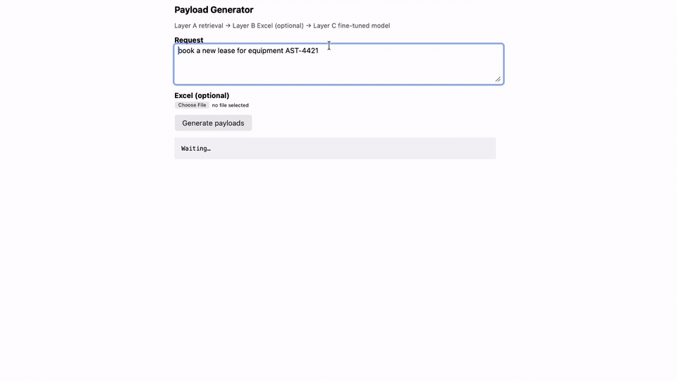

# Schema-Grounded Payload Generator (Asset-Finance)



A demonstration of how an enterprise can generate API payloads **on-prem**, using a small fine-tuned 3B model — **without relying on external AI services** for the core workflow.

The API spec is always an input at inference time, never baked into model weights. The model learns a **skill** (read any spec → emit valid JSON), not a memorized API.

> **Thesis:** A 3B model reaches ~95% schema-valid payloads on unseen asset-finance specs at effectively zero marginal cost, deployable on a laptop — and only **Layer C** (payload generation) needed fine-tuning; the rest is retrieval, mapping, and orchestration.

This project is a **working proof-of-concept**, not a production system. It shows the architecture, the eval methodology, and where each technique belongs. Further improvements are listed below and can be picked up when the business case warrants it.

---

## What this demonstrates (and what it is not)

**This is a demo** that shows:

- How to carve a fuzzy business problem into layers, fine-tuning only the piece that earns it
- How to prove the model learned a **skill** (test on specs it never saw during training)
- How a bank or asset-finance team could run payload generation **entirely on their own hardware** — no OpenAI/Anthropic API required for inference

**This is not:**

- A production-ready integration platform
- A claim that a 3B model beats frontier models on every metric
- A finished product with SLAs, auth, audit logging, or multi-tenant scaling

Known gaps (distractor handling, NL→value exact match, retrieval edge cases) are documented below. They are **incremental improvements**, not blockers to the architectural argument.

---

## Architecture

```
┌─────────────────────────────────────────────────────────────────────────┐
│  User: natural-language request (+ optional Excel upload)               │
└───────────────────────────────────┬─────────────────────────────────────┘
                                    │
                                    ▼
┌─────────────────────────────────────────────────────────────────────────┐
│  Layer A — Retrieval (NOT fine-tuned)                                 │
│  src/retrieval/retrieve.py                                            │
│  Embed specs → pick best API + operation (endpoint-level + keywords)  │
└───────────────────────────────────┬─────────────────────────────────────┘
                                    │
                                    ▼
┌─────────────────────────────────────────────────────────────────────────┐
│  Layer B — Excel mapping (NOT fine-tuned)                             │
│  src/mapping/excel_map.py                                               │
│  Messy spreadsheet columns → clean typed field values                   │
└───────────────────────────────────┬─────────────────────────────────────┘
                                    │
                                    ▼
┌─────────────────────────────────────────────────────────────────────────┐
│  Orchestration (NOT fine-tuned)                                         │
│  src/orchestration/decompose.py                                       │
│  "book a deal" → [create_asset, book_lease, …]                        │
└───────────────────────────────────┬─────────────────────────────────────┘
                                    │
                                    ▼
┌─────────────────────────────────────────────────────────────────────────┐
│  Layer C — Payload generation (FINE-TUNED 3B + LoRA)  ← only this layer │
│  mlx_lm.server @ :8080  ·  adapters/                                    │
│  Spec in system prompt → JSON payload or structured refusal             │
└───────────────────────────────────┬─────────────────────────────────────┘
                                    │
                                    ▼
                           Valid JSON payload(s)
```

**Hand-off summary:** Retrieval finds *which spec*; mapping supplies *clean values*; orchestration decides *how many steps*; the fine-tuned model produces *the JSON*. Each layer has one job.

---

## Benchmark (mechanically scored)

Eval uses `jsonschema` + exact JSON match — no human judgment. Test specs use seed `2_000_000+` (never seen in training).

| Model | Split | Rows | Schema-valid | Exact match | Refusal acc. | $/payload |
|---|---|---:|---:|---:|---:|---|
| base-3B | unseen (test) | 800 | 0.0% | 0.0% | 0.0% | ~$0 |
| base-3B | seen (valid) | 100 | 0.0% | 0.0% | 0.0% | ~$0 |
| **fine-tuned-3B** | **unseen (test)** | **800** | **94.9%** | **46.8%** | **99.0%** | **~$0** |
| fine-tuned-3B | seen (valid) | 100 | 96.0% | 53.0% | 100% | ~$0 |
| Claude (frontier) | unseen | — | *not run* | *not run* | *not run* | ~$0.01* |

\*Claude was skipped in this run. The idea of having Claude here is to define a win condition, which is that a **fine-tuned-3B can be near frontier on validity at a fraction of the cost**, not beating Claude on every field.

**Distractor analysis (fine-tuned, unseen):** non-distractor exact match 50% vs distractor exact match 37% (13-point gap). Extra distractor training is optional, not urgent.

Full results: `results/benchmark.json`

---

## When to use what (the decision section)

Knowing **when not to fine-tune** is as important as knowing when to.

| Problem | Right tool | Why |
|---|---|---|
| **Documentation Q&A** | **RAG** | Knowledge changes daily; answers need traceability to source docs; no fixed output shape to score |
| **Related tickets** | **Retrieval + embeddings** | Similarity search over a changing corpus; no single "correct" JSON answer |
| **Payload generation** | **Fine-tune (Layer C only)** | Behavior not knowledge; output is mechanically verifiable; high volume → cost matters; on-prem compliance |

| Layer | Tool | Why not fine-tune? |
|---|---|---|
| Which spec? (A) | Embeddings + retrieval | Spec set changes; don't freeze APIs in weights |
| Excel → fields (B) | Rules + fuzzy match | Deterministic; bank users already have spreadsheets |
| Multi-step planning | Simple rules (v1) | Shows the seam exists; full planner is a separate product |

**Why this section matters:** The thesis is: *only Layer C earned fine-tuning* — everything else is retrieval, mapping, or orchestration.

---

## Enterprise use: no external AI required

For inference, the full demo runs locally:

| Component | Runs on | External API? |
|---|---|---|
| Layer A retrieval | `sentence-transformers` (local) | No |
| Layer B Excel mapping | `pandas` (local) | No |
| Layer C payload model | `mlx_lm.server` + LoRA adapter (local) | No |
| Orchestration app | FastAPI (local) | No |

A MacBook Air (M5, 16GB) is sufficient for demo and moderate volume. Production would use the same pattern on internal GPU servers — still no data leaving the network.

---

## Cloning this repo

The repo is set up so you can explore without retraining. After clone, the repo is about **18MB**. The 3B base model (~2GB) is **not** in git — `mlx_lm` downloads it from Hugging Face on first run.

### What's included (ready to use)

| Included in git | Purpose |
|---|---|
| `src/`, `scripts/` | All application code |
| `adapters/adapters.safetensors` + `adapter_config.json` | **Fine-tuned LoRA** — run the demo without training |
| `specs/*.json` | Layer A spec library (12 APIs) |
| `data/valid.jsonl`, `data/test.jsonl` | Run benchmark / baseline immediately |
| `data/sample_deal.xlsx` | Layer B Excel demo |
| `results/*.json` | Pre-computed baseline, benchmark, examples |
| `docs/demo.gif` | Demo walkthrough (embedded above) |

### Not in git (and why)

| Excluded | Why | How to get it |
|---|---|---|
| `.venv/` | Recreated per machine | `pip install -r requirements.txt` |
| `data/train.jsonl` (~9MB) | Large; deterministic from fixed seeds | See **Retrain path** below |
| `adapters/0000*_adapters.safetensors` | Intermediate checkpoints during training | Only needed if you retrain |
| `mlx-community/Llama-3.2-3B-Instruct-4bit` | Base model ~2GB | Auto-download on first `mlx_lm` command |
| `results/*.log` | Local run logs | Regenerated when you train/eval |

### Three paths after clone

**1. Try the demo (fastest — ~5 min after install)**

No training. Uses the committed adapter.

```bash
git clone <your-repo-url> payload-gen && cd payload-gen
python3 -m venv .venv && source .venv/bin/activate
pip install -r requirements.txt

# Terminal 1
mlx_lm.server --model mlx-community/Llama-3.2-3B-Instruct-4bit \
  --adapter-path ./adapters --port 8080

# Terminal 2
uvicorn server:app --app-dir src/app --host 127.0.0.1 --port 8000
```

Open http://localhost:8000. First model load downloads weights once (~2GB), then caches locally.

**2. Reproduce the numbers (no training — ~1 hour for full benchmark)**

Uses committed adapter + `data/test.jsonl` / `data/valid.jsonl`.

```bash
python scripts/baseline.py --output results/baseline.json   # ~40 min on 800 rows
python scripts/benchmark.py --eval-seen --valid-limit 100   # reuses baseline for base model
python scripts/phase5_demo.py                             # 3 quick demo cases
```

**3. Retrain from scratch (~1 hour training + data gen)**

Regenerates training data, then fine-tunes a new adapter.

```bash
# Regenerate train + valid (test set uses a separate seed — add when ready for eval)
python src/generator/build_dataset.py
python src/generator/build_dataset.py --train-count 0 --valid-count 0 --test-count 800

mlx_lm.lora --model mlx-community/Llama-3.2-3B-Instruct-4bit --train \
  --data ./data --fine-tune-type lora --batch-size 1 --num-layers 8 \
  --iters 600 --learning-rate 2e-4 --save-every 100 --grad-checkpoint \
  --adapter-path ./adapters
```

Optional: rebuild the spec library for Layer A — `python src/retrieval/retrieve.py --build`

---

## Quick start

```bash
cd payload-gen
python3 -m venv .venv && source .venv/bin/activate
pip install -r requirements.txt

# Terminal 1 — fine-tuned model (Layer C)
mlx_lm.server \
  --model mlx-community/Llama-3.2-3B-Instruct-4bit \
  --adapter-path ./adapters \
  --port 8080

# Terminal 2 — chat UI + orchestration
uvicorn server:app --app-dir src/app --host 127.0.0.1 --port 8000
```

Open http://localhost:8000 — or run `./scripts/start_demo.sh` for both servers.

See **Cloning this repo** above for what's included vs. what you need to regenerate.

---

## Known limitations & improvements (when needed)

These are **documented gaps**, not surprises.

| Area | Current state | Improvement (when needed) |
|---|---|---|
| **Exact match (~47%)** | NL dates/amounts parsed imperfectly | Route values through Layer B (Excel); more training variety |
| **Distractors (~13pt gap)** | Model sometimes includes decoy fields | Raise distractor rate in training data; short adapter retrain |
| **Retrieval** | 12 similar specs; embedding scores ~0.4–0.7 | Spec metadata, reranker, or hybrid search at scale |
| **Orchestration** | Rule-based multi-step only | Claude/rules engine for complex workflows (still not fine-tune) |
| **Security / ops** | Demo has no auth, audit, or rate limits | Standard enterprise hardening |
| **Claude benchmark** | Not run in default eval | Set `ANTHROPIC_API_KEY` for frontier comparison |

The architecture stays the same; each row is an incremental upgrade, not a redesign.

---

## Project layout

```
payload-gen/
├── docs/                  Demo GIF and assets
├── adapters/              LoRA weights (Layer C)
├── specs/                 API spec library (Layer A)
├── data/                  train / valid / test JSONL
├── src/
│   ├── retrieval/         Layer A
│   ├── mapping/           Layer B
│   ├── orchestration/     Multi-step decomposition
│   ├── generator/         Synthetic training data
│   ├── eval/              Scoring + mock server
│   └── app/               FastAPI + chat UI
├── scripts/               baseline, benchmark, demo startup
└── results/               baseline, benchmark, examples, training log
```

---

## Reproduce key results

```bash
# Baseline (base model, no adapter)
python scripts/baseline.py --output results/baseline.json

# Fine-tuned benchmark
python scripts/benchmark.py --eval-seen --valid-limit 100

# Phase 5 demos (3 cases on unseen specs)
python scripts/phase5_demo.py

# Retrieval smoke test
python src/retrieval/retrieve.py --request "book a new lease for equipment AST-4421"

# Excel mapping demo
python src/mapping/excel_map.py
```

---

## Governing idea

**The spec is always an input, never memorized.** The model learned a skill by testing on specs generated with a seed range it never saw in training (`2_000_000+` vs train `1_000–6_999`). If the fine-tuned model succeeds there, it read the spec — it didn't recall a training example.
